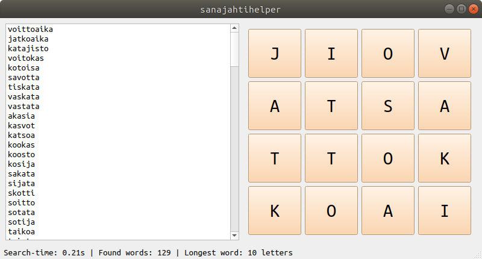

# Sanajahti-helper

[Sanajahti/Wordz](https://fi.wikipedia.org/wiki/Sanajahti) is a puzzle game
where player has to find words in 4x4 grid by connecting letters horizontally,
vertically or diagonally. 
This program made with PyQt5 helps user find Finnish words. You can select letters
into grid by clicking section of grid and then input letter.

### Screenshot:

### Inputs:
|Key    |Action |
|-------|-------|
|Enter  |Start search|
|Del    |Clear grid|

Grid must be filled to begin search. 
